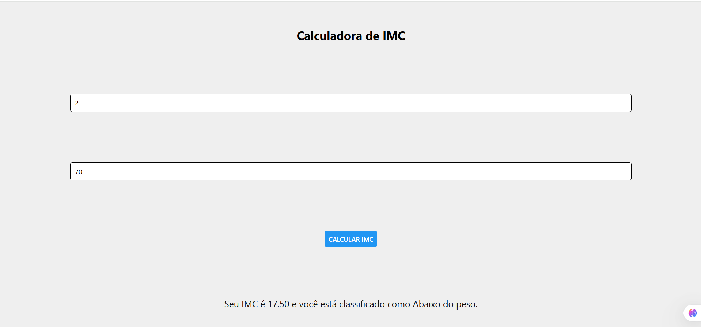

# Calculadora IMC

Aplicativo para calcular o Índice de Massa Corporal (IMC) a partir da altura e peso do usuário.

## 🔧 Funcionalidades
- Entrada de altura (cm) e peso (kg)
- Cálculo do IMC
- Classificação automática (abaixo do peso, normal, sobrepeso etc.)

## 🛠️ Tecnologias Usadas
- React Native
- React
- Expo
- JavaScript

## ▶️ Como Executar
```bash
git clone https://github.com/seu-usuario/calculadora-imc
cd calculadora-imc
npm install
npm start
```

## 🖼️ Imagem

